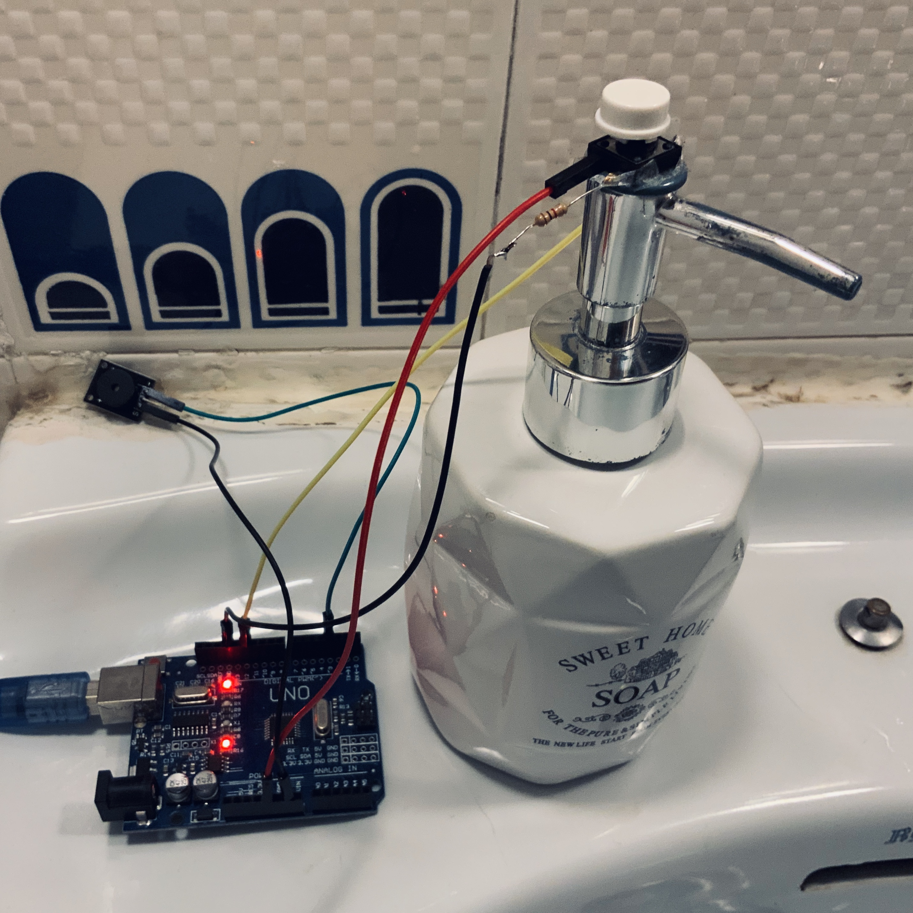
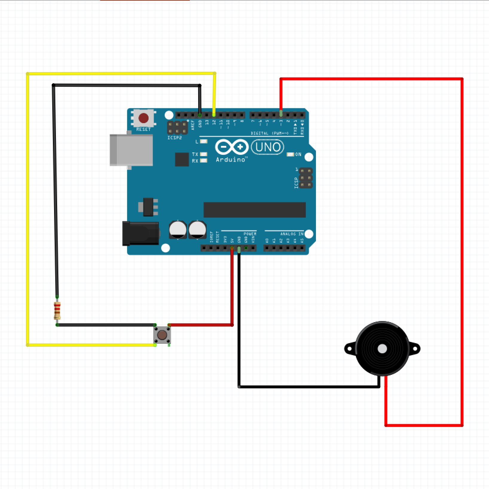

# The Washing Hands Sounds Good Soap Dispenser

During Covid-19 Pandemic, we have learned that the best way to fight this damn virus is to wash our hands often with :soap: and :droplet: for at least 20 seconds (according The Centers for Disease Control and Prevention). And yes, it's true. It's a bit boring to wash your hands for 20 seconds.

But what if during those endless 20 seconds we listened to an epic song that made us forget about time?

Let me introduce **The Washing Hands Sounds Good Soap Dispenser**.

Maybe people think that the naming is too long, but I love it. And it sounds good. :wink:

The Washing Hands Sounds Good Soap Dispenser is a little idea and a cheap DIY project that it's very easy to make.

The version 1.0.0 was launched to commemorate the Star Wars Day (May the 4th, 2020).

## What do you need to do it yourself?

**🛒 Price list (to the first and basic prototype):**

- Buzzer: €0.12
- 1k resistor: €0.10
- Switch: €0.04
- A few wires: €0.02
- ATmega328P board: €3.43
- Power bank (500mA)*: €4.50

**TOTAL: €8.21**

*The battery life depends on the times that the user washes their hands (hopefully many). With the 500mA power bank, version 1.0.0 lasts for approximately 32 hours, having been used 22 times.

## Upcoming features and To Do list:

- [x] Launch prototype on May the 4th, 2020
- [ ] Optimize gadget size (Arduino Nano?)
- [ ] Make it with MP3 songs
- [ ] Add random function to play a lot of shuffle songs
- [ ] AI layer to detect water constantly running
- [ ] Add fingerprint to personalize songs for the whole family
- [ ] Make a nice ceramic soap dispenser to give to friends
